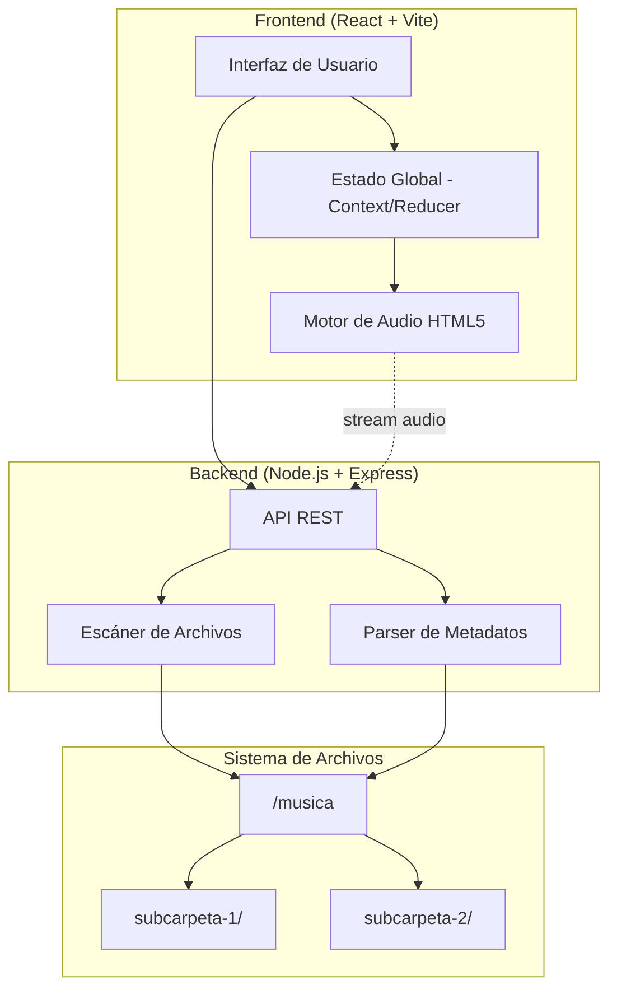
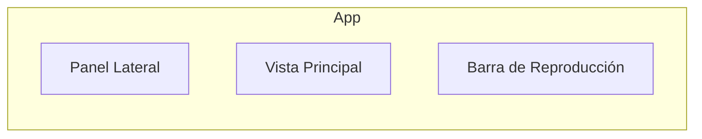

# Design Document

## Overview

Este documento describe el diseño técnico del reproductor de música local "SpotiMP4", una aplicación web que escanea una carpeta local llamada "musica", interpreta las subcarpetas como playlists y reproduce archivos MP3/MP4 con una interfaz visual inspirada en Spotify con acentos en tonos magenta/rosa.

La arquitectura se compone de un **backend en Node.js con Express** que escanea el sistema de archivos, extrae metadatos de audio y sirve los archivos, y un **frontend en React con Vite** que presenta la interfaz de usuario y controla la reproducción usando el elemento HTML5 `<audio>`.

### Decisiones clave de diseño

1. **Arquitectura cliente-servidor local**: Se usa Express como servidor para acceder al sistema de archivos (lectura de carpetas, metadatos). El frontend React consume una API REST local.
2. **HTML5 Audio Element**: Se utiliza `HTMLAudioElement` en lugar de la Web Audio API porque los requisitos son de reproducción estándar sin efectos de audio avanzados.
3. **music-metadata (Node.js)**: Librería para parsear etiquetas ID3v2 (MP3) y metadatos MP4 en el backend, soporta formatos múltiples y es activamente mantenida.
4. **React + Vite + TypeScript**: Framework moderno para UI con tipado estático, hot reload rápido y excelente DX.
5. **CSS Variables con tema magenta**: Esquema de colores gestionado mediante CSS custom properties para mantener consistencia visual.

## Architecture



### Flujo de datos principal

1. Al iniciar, el frontend solicita `GET /api/playlists` al backend.
2. El backend escanea la carpeta "musica", lee subcarpetas de primer nivel y extrae metadatos de cada archivo MP3/MP4.
3. El frontend recibe la lista de playlists con sus pistas y las renderiza.
4. Al seleccionar una pista, el frontend crea un `Audio` con `src` apuntando a `GET /api/stream/:playlistName/:fileName`.
5. El backend sirve el archivo como stream con los headers MIME apropiados.

## Components and Interfaces

### Backend Components

#### FileScanner (`src/server/services/fileScanner.ts`)

Responsable de escanear la carpeta "musica" y retornar la estructura de playlists.

```typescript
interface ScanResult {
  playlists: PlaylistInfo[];
  errors: ScanError[];
}

interface PlaylistInfo {
  name: string;
  path: string;
  tracks: TrackFile[];
}

interface TrackFile {
  fileName: string;
  filePath: string;
  extension: 'mp3' | 'mp4';
}

interface ScanError {
  type: 'folder_not_found' | 'permission_denied';
  message: string;
}

function scanMusicFolder(basePath: string): Promise<ScanResult>;
```

#### MetadataParser (`src/server/services/metadataParser.ts`)

Extrae metadatos de archivos de audio usando `music-metadata`.

```typescript
interface TrackMetadata {
  title: string;
  artist: string;
  album: string;
  durationSeconds: number;
}

function parseTrackMetadata(filePath: string): Promise<TrackMetadata>;
```

Reglas de fallback:
- Si no hay título: usar nombre del archivo sin extensión
- Si no hay artista: "Artista desconocido"
- Si no hay álbum: cadena vacía
- Si no hay duración en metadatos: obtener del stream de audio

#### API Routes (`src/server/routes/`)

| Endpoint | Método | Descripción |
|----------|--------|-------------|
| `/api/playlists` | GET | Retorna todas las playlists con pistas y metadatos |
| `/api/stream/:playlist/:track` | GET | Sirve archivo de audio como stream |

#### StreamController (`src/server/controllers/streamController.ts`)

Sirve archivos de audio con soporte para Range Requests (seek en el reproductor).

```typescript
function streamTrack(req: Request, res: Response): void;
```

### Frontend Components

#### Layout Principal



#### Componentes React

| Componente | Responsabilidad |
|------------|----------------|
| `App` | Layout raíz, provee contexto global |
| `Sidebar` | Lista de playlists, indicador de pistas |
| `PlaylistView` | Lista de pistas con título, artista, duración |
| `SearchBar` | Campo de búsqueda con filtrado en tiempo real |
| `PlayerBar` | Controles de reproducción, progreso, volumen |
| `TrackInfo` | Muestra título y artista de la pista actual |
| `ProgressBar` | Barra de progreso interactiva (seek) |
| `VolumeControl` | Slider de volumen + botón mute |

#### PlayerContext (`src/client/context/PlayerContext.tsx`)

Estado global de reproducción gestionado con `useReducer`.

```typescript
interface PlayerState {
  currentTrack: Track | null;
  queue: Track[];
  queueIndex: number;
  isPlaying: boolean;
  currentTime: number;
  duration: number;
  volume: number;
  previousVolume: number;
  isMuted: boolean;
}

type PlayerAction =
  | { type: 'PLAY_TRACK'; payload: { track: Track; queue: Track[]; index: number } }
  | { type: 'PAUSE' }
  | { type: 'RESUME' }
  | { type: 'NEXT_TRACK' }
  | { type: 'PREVIOUS_TRACK' }
  | { type: 'SEEK'; payload: number }
  | { type: 'SET_VOLUME'; payload: number }
  | { type: 'TOGGLE_MUTE' }
  | { type: 'TRACK_ENDED' }
  | { type: 'UPDATE_TIME'; payload: number }
  | { type: 'SET_DURATION'; payload: number }
  | { type: 'TRACK_ERROR'; payload: string };
```

#### useAudioEngine (`src/client/hooks/useAudioEngine.ts`)

Hook personalizado que encapsula la interacción con `HTMLAudioElement`.

```typescript
interface AudioEngineControls {
  play: (src: string) => void;
  pause: () => void;
  resume: () => void;
  seek: (time: number) => void;
  setVolume: (volume: number) => void;
}
```

## Data Models

### Modelo de Playlist

```typescript
interface Playlist {
  name: string;           // Nombre de la subcarpeta
  trackCount: number;     // Cantidad de pistas
  tracks: Track[];        // Lista de pistas
}
```

### Modelo de Pista (Track)

```typescript
interface Track {
  id: string;              // Identificador único (playlist + fileName hash)
  fileName: string;        // Nombre del archivo con extensión
  title: string;           // Título del metadato o nombre sin extensión
  artist: string;          // Artista o "Artista desconocido"
  album: string;           // Álbum o cadena vacía
  durationSeconds: number; // Duración en segundos
  playlist: string;        // Nombre de la playlist contenedora
  streamUrl: string;       // URL para reproducir: /api/stream/{playlist}/{fileName}
}
```

### Modelo de respuesta API

```typescript
// GET /api/playlists
interface PlaylistsResponse {
  success: boolean;
  data: Playlist[];
  error?: string;  // Presente si la carpeta "musica" no existe
}
```

### Formato de duración (display)

```typescript
function formatDuration(seconds: number): string {
  // Si < 3600: "mm:ss"
  // Si >= 3600: "hh:mm:ss"
}
```

### Lógica de truncado de texto

```typescript
function truncateText(text: string, maxLength: number = 50): string {
  // Si text.length > maxLength: retornar text.slice(0, maxLength) + "…"
  // Si no: retornar text sin cambios
}
```

### Lógica del botón "Anterior"

```typescript
function handlePrevious(currentTime: number, queueIndex: number): 'restart' | 'previous' {
  // Si currentTime >= 3: reiniciar pista actual
  // Si currentTime < 3 y queueIndex > 0: ir a pista anterior
  // Si currentTime < 3 y queueIndex === 0: reiniciar pista actual
}
```

### Lógica de búsqueda

```typescript
function filterTracks(tracks: Track[], query: string): Track[] {
  // Filtrar pistas cuyo título o artista contengan query (case-insensitive)
  // Si query está vacío: retornar todas las pistas
}
```

## Correctness Properties

*A property is a characteristic or behavior that should hold true across all valid executions of a system—essentially, a formal statement about what the system should do. Properties serve as the bridge between human-readable specifications and machine-verifiable correctness guarantees.*

### Property 1: Playlist alphabetical sorting

*For any* list of subfolder names returned by the file scanner, the resulting playlists array SHALL be sorted in alphabetical order (locale-insensitive, case-insensitive comparison).

**Validates: Requirements 1.1**

### Property 2: File extension filtering

*For any* directory listing containing files with various extensions and nested subdirectories, the file scanner SHALL return only files with `.mp3` or `.mp4` extensions at the first level, excluding all other files and all contents of nested subdirectories.

**Validates: Requirements 1.2**

### Property 3: Duration formatting

*For any* non-negative duration in seconds, `formatDuration` SHALL return a string in `mm:ss` format when the duration is less than 3600 seconds, and `hh:mm:ss` format when the duration is 3600 seconds or more, where each component is zero-padded to 2 digits.

**Validates: Requirements 2.2, 6.4**

### Property 4: Queue advancement

*For any* queue of tracks and any valid current index, advancing to the next track SHALL set the current index to `index + 1` if `index < queue.length - 1`, and SHALL stop playback (isPlaying = false) if `index === queue.length - 1`.

**Validates: Requirements 2.5, 2.6, 3.1, 3.2**

### Property 5: Previous track decision logic

*For any* current playback time in seconds and any queue index, `handlePrevious` SHALL return `'restart'` if `currentTime >= 3` OR `queueIndex === 0`, and SHALL return `'previous'` only if `currentTime < 3` AND `queueIndex > 0`.

**Validates: Requirements 3.3, 3.4, 3.5**

### Property 6: Seek bounds invariant

*For any* seek operation with a target time and a track with a given duration, the resulting playback position SHALL be clamped to the range `[0, duration]`.

**Validates: Requirements 3.6**

### Property 7: Volume clamping

*For any* volume value set by the user, the resulting volume level SHALL be clamped to the range `[0, 1]` (representing 0% to 100%).

**Validates: Requirements 3.7**

### Property 8: Mute/unmute round trip

*For any* volume level `v` in `[0, 1]`, muting SHALL set the active volume to 0 while preserving `v` as `previousVolume`, and subsequently unmuting SHALL restore the active volume to exactly `v`.

**Validates: Requirements 3.8, 3.9**

### Property 9: Queue alphabetical ordering

*For any* list of tracks in a playlist, when the user starts playback from that playlist, the queue SHALL be ordered alphabetically by track title (matching the sort used for display).

**Validates: Requirements 4.3**

### Property 10: Metadata fallback logic

*For any* metadata object with potentially missing fields (title, artist, album, duration), the metadata parser SHALL apply these fallbacks: missing title → file name without extension, missing artist → "Artista desconocido", missing album → empty string, and always return a valid duration > 0.

**Validates: Requirements 6.2**

### Property 11: Text truncation

*For any* string, `truncateText` SHALL return the original string unchanged if its length is ≤ 50 characters, and SHALL return the first 50 characters followed by "…" if its length exceeds 50 characters.

**Validates: Requirements 6.5**

### Property 12: Search filter correctness

*For any* list of tracks and any search query string, `filterTracks` SHALL return only tracks whose title or artist contains the query substring (case-insensitive comparison), and SHALL return all tracks when the query is an empty string. The queue set from search results SHALL equal the filtered output in its original order.

**Validates: Requirements 7.2, 7.4, 7.6**

## Error Handling

### Backend Errors

| Escenario | Comportamiento |
|-----------|----------------|
| Carpeta "musica" no existe | Retorna `{ success: false, data: [], error: "Carpeta 'musica' no encontrada" }` |
| Carpeta sin permisos de lectura | Retorna error con mensaje descriptivo |
| Archivo con metadatos corruptos | Aplica fallbacks (nombre de archivo como título, etc.) |
| Archivo no encontrado durante stream | Retorna HTTP 404 |
| Extensión no soportada | Archivo ignorado durante escaneo |

### Frontend Errors

| Escenario | Comportamiento |
|-----------|----------------|
| API no disponible | Muestra mensaje de error en la interfaz |
| Archivo no reproducible (corrupto/no encontrado) | Muestra notificación de error, salta a siguiente pista |
| Última pista en cola finaliza | Detiene reproducción, muestra estado detenido |
| Búsqueda sin resultados | Muestra mensaje "No se encontraron pistas" |

### Estrategia de manejo de errores de audio

```typescript
audioElement.onerror = () => {
  // 1. Mostrar notificación con nombre del archivo que falló
  // 2. Disparar TRACK_ERROR action
  // 3. Automáticamente avanzar a siguiente pista (si existe)
  // 4. Si no hay siguiente pista, detener reproducción
};
```

## Testing Strategy

### Enfoque dual de testing

La estrategia combina tests unitarios para casos específicos con tests basados en propiedades para verificar comportamiento universal.

### Tests unitarios (example-based)

- **Escaneo de carpeta**: Verificar comportamiento con carpeta inexistente, carpeta vacía, playlists sin audio
- **Reproducción**: Verificar play/pause/resume, manejo de errores de archivo
- **UI**: Verificar que componentes renderizan correctamente, controles deshabilitados sin pista activa
- **Integración de metadatos**: Tests con archivos reales MP3/MP4

### Tests basados en propiedades (property-based)

**Librería**: [fast-check](https://github.com/dubzzz/fast-check) para TypeScript/JavaScript

**Configuración**: Mínimo 100 iteraciones por propiedad.

Cada test de propiedad referencia su propiedad de diseño con el siguiente formato de tag:

```
// Feature: local-music-player, Property {N}: {título}
```

**Propiedades a implementar**:

| # | Propiedad | Generadores principales |
|---|-----------|------------------------|
| 1 | Playlist alphabetical sorting | Arrays de strings aleatorios (nombres de carpeta) |
| 2 | File extension filtering | Arrays de objetos {name, extension, isDirectory} |
| 3 | Duration formatting | Números positivos (0 a 100000 segundos) |
| 4 | Queue advancement | Arrays de tracks + índice aleatorio |
| 5 | Previous track decision | Pares (currentTime: float, queueIndex: int) |
| 6 | Seek bounds invariant | Pares (seekTarget: float, duration: float positivo) |
| 7 | Volume clamping | Números flotantes (-1 a 2) |
| 8 | Mute/unmute round trip | Volúmenes en [0, 1] |
| 9 | Queue alphabetical ordering | Arrays de tracks con títulos aleatorios |
| 10 | Metadata fallback logic | Objetos metadata con campos opcionales null/undefined |
| 11 | Text truncation | Strings de longitud variable (0 a 200 caracteres) |
| 12 | Search filter correctness | Arrays de tracks + query substrings |

### Herramientas de testing

- **Vitest**: Test runner compatible con Vite
- **fast-check**: Property-based testing
- **@testing-library/react**: Tests de componentes React
- **supertest**: Tests de endpoints Express

